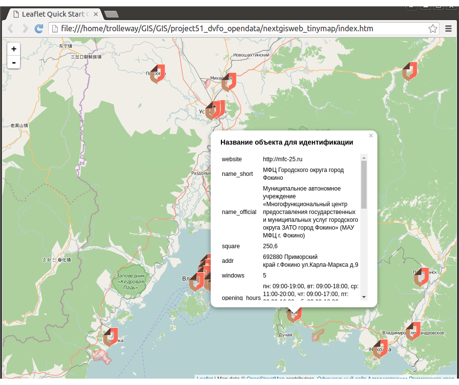

# nextgisweb_tinymap
Simple Lefleat based map frontend for [NextGIS Web](http://nextgis.ru/nextgis-web).

One-page map with one layer added from NextGIS Web. You can click on features and see their attributes. This app provides an example of how to make maps with NGW for your website.

Live demo: http://nextgis.github.io/nextgisweb_tinymap/




Installation
--------------------


1. Rename config.example.js to config.js
2. Set ngwLayerURL

```
ngwLayerURL: 'http://176.9.38.120/practice2/api/resource/31'
```

Bounding box will be calculated authomatically.

Commercial support
----------
Need to fix a bug or add a feature to nextgisweb_tinymap? We provide custom development and support for this software. [Contact us](http://nextgis.ru/en/contact/) to discuss options!

[](http://nextgis.com)


